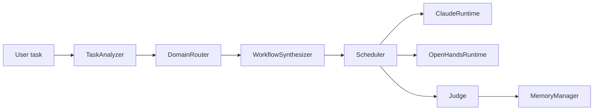

# MetaWorkflow (meta-controller prototype)

**Task → structured spec → domain routing → workflow graph (DAG) → pluggable runtimes → judge & episode archive.**

A pragmatic prototype of a **meta-controller** that compiles natural-language tasks into executable multi-agent workflows. It supports **coding**, **research**, **hybrid**, **direct answer**, **retrieval**, and **ops**-style routes, with **Claude Code SDK** and **OpenHands** as backends (plus **dry-run** when live runtimes are unavailable).

Repository: [github.com/billion-token-one-task/MetaWorkflow](https://github.com/billion-token-one-task/MetaWorkflow)

## What it does

| Stage | Responsibility |
|--------|----------------|
| **TaskAnalyzer** | NL task → structured `TaskSpec` (domain, difficulty, tools, deliverables, …) |
| **DomainRouter** | Chooses mode + YAML template + runtime preference |
| **WorkflowSynthesizer** | Instantiates a `WorkflowSpec` (DAG) from templates under `src/meta_controller/graphs/templates/` |
| **Scheduler** | Topological execution, upstream context passing, runtime **fallback** / retries |
| **Judge** | Verdict (`accept` / `revise` / `fail`), scaffold edit hints |
| **MemoryManager** | Similar-task retrieval, episode persistence |

## Architecture (high level)



Execution is **role-based**: each graph node has a `role` (e.g. implementer, test_runner, literature_scout) mapped to workers in `src/meta_controller/workers/`.

## Requirements

- Python **3.10+** (repo tested with 3.12)
- Optional: [Claude Code](https://www.anthropic.com/claude-code) login for live `claude_code_sdk` runs
- Optional: OpenHands / model config for `openhands` path (see `config/runtime.example.toml`)

## Install

```bash
git clone https://github.com/billion-token-one-task/MetaWorkflow.git
cd MetaWorkflow
python3.12 scripts/bootstrap_env.py
```

Copy and edit runtime secrets (not committed):

```bash
cp config/runtime.example.toml config/runtime.local.toml
# edit config/runtime.local.toml
```

## Quick start

Dry-run episode (no live LLM tools required):

```bash
.venv/bin/python scripts/run_episode.py \
  --task "Implement a dynamic workflow synthesizer with tests for a multi-agent controller."
```

Live run with Claude Code SDK (uses local Claude Code auth; set project path to your repo):

```bash
.venv/bin/python scripts/run_episode.py \
  --live \
  --project-path "$(pwd)" \
  --task "Summarize this repository architecture and propose the next runtime integration steps."
```

## Smoke & harness

```bash
.venv/bin/python scripts/run_runtime_smoke.py
.venv/bin/python scripts/run_coding_smoke.py
.venv/bin/python scripts/run_coding_smoke.py --heavy
.venv/bin/python scripts/run_harness.py
.venv/bin/python scripts/run_harness.py --include-heavy
.venv/bin/python scripts/run_harness.py --scenario runtime_smoke_full
```

## Tests

```bash
.venv/bin/python scripts/run_tests.py
```

## Project layout

| Path | Purpose |
|------|---------|
| `src/meta_controller/controller.py` | `MetaController` orchestration |
| `src/meta_controller/core/` | Analyzer, router, synthesizer, scheduler, judge, memory |
| `src/meta_controller/runtimes/` | Claude / OpenHands adapters |
| `src/meta_controller/workers/` | Role workers (coding, research, …) |
| `src/meta_controller/graphs/templates/` | Workflow YAML templates |
| `config/` | Example + local runtime TOML |

## Notes

- **Dry-run**: the control plane, synthesis, scheduling, and logging still run end-to-end; worker steps return simulated results when live SDKs are missing or `--live` is not used.
- **Security**: never commit `config/runtime.local.toml` (API keys, endpoints).
