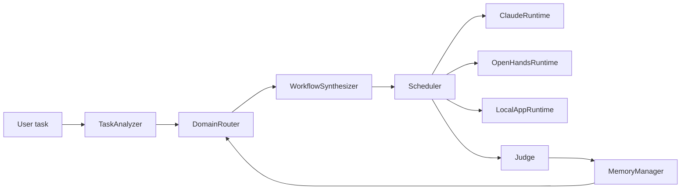

# MetaWorkflow

**Task -> structured task spec -> adaptive workflow -> execution runtimes -> verification -> memory -> route evolution**

MetaWorkflow is a meta-controller prototype for turning natural-language tasks into executable multi-agent workflows. The project started as a constrained DAG orchestrator and now includes an initial **self-evolving routing loop** for application prototype tasks:

- task analysis turns free text into a `TaskSpec`
- domain routing selects a task mode and candidate workflow space
- workflow synthesis instantiates a DAG from a template library
- scheduler executes workers across Claude Code SDK, OpenHands, and local verifier runtimes
- judge produces verdicts and scaffold-edit hints
- memory stores episodes, workflow selections, and route history
- later runs can use prior outcomes as **route hints**

Repository: [github.com/billion-token-one-task/MetaWorkflow](https://github.com/billion-token-one-task/MetaWorkflow)

## Current Focus

The system now supports several task families:

- `direct_answer`
- `coding`
- `research`
- `mixed`
- `prototype_app`

The most important recent addition is `prototype_app_mode`, which routes frontend/backend prototype requests into dedicated app-building workflows instead of generic bugfix flows.

## What MetaWorkflow Actually Does

| Layer | Responsibility |
| --- | --- |
| `TaskAnalyzer` | Task text -> domain, subdomains, difficulty, deliverables, validation needs |
| `DomainRouter` | Chooses route mode, candidate templates, runtime preference |
| `WorkflowSynthesizer` | Turns a route into a concrete workflow DAG |
| `Scheduler` | Runs workflow nodes with retries and runtime fallback |
| `Judge` | Produces verdicts and issues |
| `MemoryManager` | Stores episodes, workflow index, scaffold edits, route evolution events |
| `ScaffoldEditor` | Converts judge feedback into structured improvement suggestions |

## Runtime Backends

MetaWorkflow currently uses three runtime classes:

- `claude_sdk`
  - live Claude Code SDK execution
  - best for repo exploration, code edits, tests, and reviews
- `openhands`
  - heavier app/software execution path
  - currently best used with runtime fallback enabled
- `local_app`
  - deterministic local verifier runtime
  - used for app startup, healthcheck, dependency install, and test execution

## Architecture



## Install

Requirements:

- Python `3.10+` (tested with `3.12`)
- optional Claude Code authentication for live Claude SDK execution
- optional model provider config for OpenHands

Bootstrap:

```bash
git clone https://github.com/billion-token-one-task/MetaWorkflow.git
cd MetaWorkflow
python3.12 scripts/bootstrap_env.py
```

Create local runtime config:

```bash
cp config/runtime.example.toml config/runtime.local.toml
```

Then edit:

- `model`
- `review_model`
- `model_provider`
- provider `base_url`
- provider `api_key`

`config/runtime.local.toml` is intentionally gitignored.

## Quick Start

### Run a Single Episode

Dry-run:

```bash
.venv/bin/python scripts/run_episode.py \
  --task "Implement a dynamic workflow synthesizer with tests for a multi-agent controller."
```

Live:

```bash
.venv/bin/python scripts/run_episode.py \
  --live \
  --project-path "$(pwd)" \
  --task "Why can adaptive plans beat static plans?"
```

### Run the Harness

Default stable gate:

```bash
.venv/bin/python scripts/run_harness.py
```

This runs:

- `runtime_smoke`
- `coding_smoke`

Heavier gate:

```bash
.venv/bin/python scripts/run_harness.py --include-heavy
```

This additionally runs:

- `coding_smoke_heavy`

Optional direct OpenHands runtime probe:

```bash
.venv/bin/python scripts/run_harness.py --scenario runtime_smoke_full
```

## Smoke Scripts

You can run each scenario directly:

```bash
.venv/bin/python scripts/run_runtime_smoke.py
.venv/bin/python scripts/run_runtime_smoke.py --skip-openhands-direct
.venv/bin/python scripts/run_coding_smoke.py
.venv/bin/python scripts/run_coding_smoke.py --heavy
```

## Real Task Validation

Batch real-task runner:

```bash
.venv/bin/python scripts/run_real_tasks.py
```

This creates a persistent batch under:

- `runs/real_tasks/batch_<timestamp>/`

Each task gets:

- `repo/`
- `result.json`

The batch also gets:

- `summary.json`

### Real Tasks Currently Used

- `log_app`
- `todo_app`
- `notes_app`
- `expense_app`
- `bookmark_app`
- `inventory_app`

These tasks are intentionally more realistic than smoke tests and are used to pressure the routing and app-generation workflows.

## Dynamic Workflow Behavior

### General Coding Tasks

Typical templates:

- `issue_triage_fix_test`
- `repo_explore_implement_test_review`

Typical roles:

- `repo_explorer`
- `task_planner`
- `implementer`
- `test_runner`
- `reviewer`

### Prototype App Tasks

Prototype-app tasks are detected from terms like:

- `frontend`
- `backend`
- `fullstack`
- `flask`
- `fastapi`
- `express`
- `sqlite`
- `app`

Current adaptive templates:

- `prototype_app_builder_verify`
- `prototype_app_direct_builder_verify`

Typical roles:

- `app_spec_extractor`
- `fullstack_builder`
- `app_verifier`

The important part is that the system no longer has a single hardcoded path for app generation. It can now choose between:

- a spec-first route
- a direct builder route

based on task shape and route hints from previous runs.

## Self-Evolution: What Is Already There

This is still an early version, but the system now records enough to support route evolution.

Files produced during runs:

- `runs/workflow_index.jsonl`
  - task text
  - domain / subdomains
  - selected workflow template
  - route mode
  - success / verdict
- `runs/scaffold_edits.jsonl`
  - judge-driven improvement suggestions
- `runs/negative_memory.jsonl`
  - failed runs and issues
- `runs/evolution_log.jsonl`
  - route hints used
  - template chosen
  - success outcome

Current route evolution is still simple:

- retrieve prior similar tasks
- score templates by past success/failure
- prefer a historically stronger template when task similarity is high

This is not full graph evolution yet, but it is already beyond static routing.

## Example: End-to-End Prototype Success

The system now reaches `accept` on real prototype-app tasks. For example:

- `manual_log_app_rerun_v3`
  - produced a Flask + SQLite + frontend + tests prototype
  - passed local verification
  - received `success = true`

Artifacts live under:

- [manual_log_app_rerun_v3](/home/ec2-user/meta_controller/runs/real_tasks/manual_log_app_rerun_v3)

## Project Layout

| Path | Purpose |
| --- | --- |
| `src/meta_controller/controller.py` | top-level orchestration entrypoint |
| `src/meta_controller/core/` | analyzer, router, synthesizer, scheduler, judge, memory |
| `src/meta_controller/runtimes/` | Claude, OpenHands, and local verification runtimes |
| `src/meta_controller/workers/` | worker roles |
| `src/meta_controller/graphs/templates/` | YAML workflow templates |
| `src/meta_controller/eval/` | harness and scenario aggregation |
| `scripts/` | bootstrap, harness, smoke, and real-task runners |
| `config/` | runtime config templates |

## Useful Commands

Run tests:

```bash
.venv/bin/python scripts/run_tests.py
```

Start one generated log app:

```bash
cd runs/real_tasks/batch_20260407_171616/log_app/repo
.venv/bin/python app.py
```

Expose that app with Cloudflare Quick Tunnel:

```bash
cloudflared tunnel --url http://127.0.0.1:5000 --no-autoupdate
```

## Current Boundaries

What works well now:

- small coding tasks
- repo bugfix loops
- runtime fallback
- prototype-app generation for several local app types
- local app verification with venv install, tests, startup, and healthcheck

What is still early:

- richer graph evolution beyond template preference
- truly free-form workflow synthesis
- large research execution loops
- long-horizon multi-stage scientific automation
- robust direct OpenHands runtime success without relying on fallback in all cases

## Philosophy

This repository is not trying to be only a fixed scaffold generator and not trying to be only a static orchestrator.

The intended direction is:

- keep enough structure to make execution reliable
- keep enough flexibility that the workflow can evolve per task
- use memory from prior runs to improve route selection over time

That is the current working definition of the project's meta-workflow direction.
